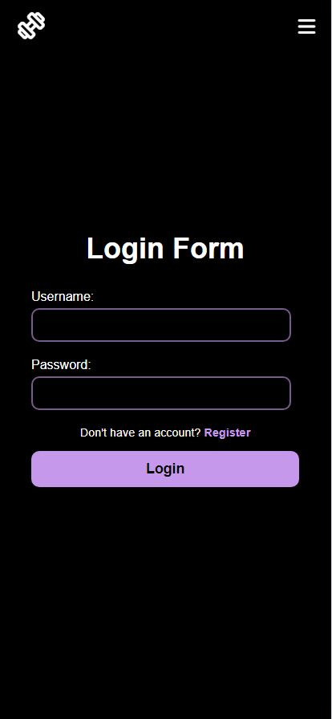
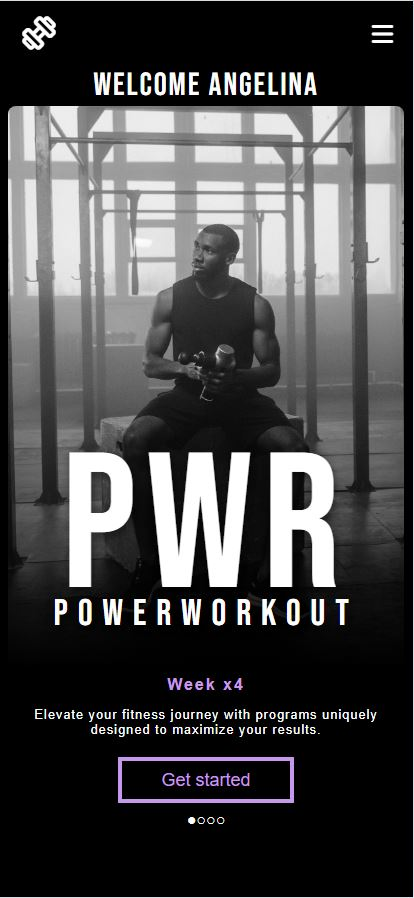
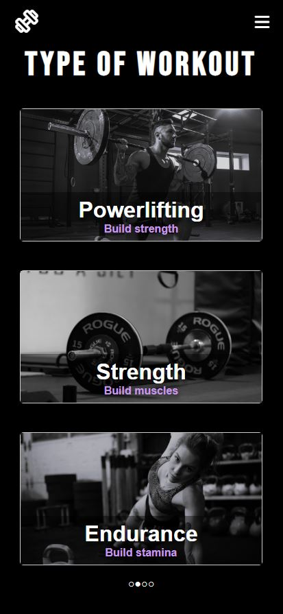
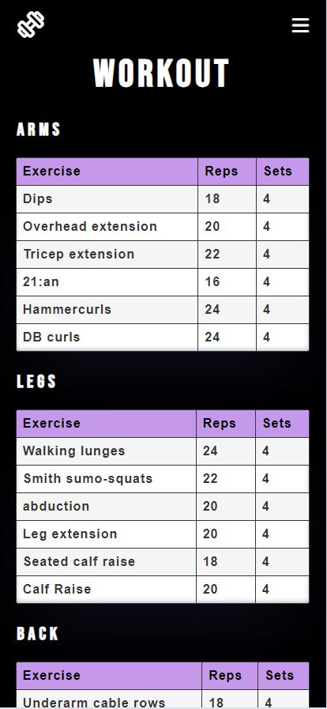

# SkillTrainy
## About

SkillTrainy is a comprehensive fitness app dedicated to helping individuals achieve their fitness goals.

### Log in page

Users are presented with a login form where they can enter their credentials to access their accounts. For new users, there is a registration form to sign up for SkillTrainy.

### Index page

* The welcome page serves as an entry point, providing users with a glimpse into the features and offerings of the application.
  

### Program selection

* Users are presented with a variety of workout programs, each represented by a distinct card showcasing specific types of workouts such as Powerlifting, Strength, and Endurance. Clicking on a card dynamically adjusts the repetition randomization range to align with the user's preferences for the upcoming training session.

### Workout

* Upon selecting their preferred workout program, SkillTrainy dynamically generates five distinct workouts, each meticulously crafted to target specific muscle groups and align with individual fitness objectives. Two compound movements and 4 isolated exercises.

